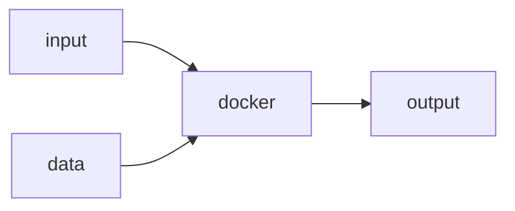

# Tool specification

## Overview

This document describes specifications for generic [`Tool`](./tool.md) entities. A `Tool` is:
*  any executable software
*  contained in a docker (compatible) container 
*  transforms optional [`Parameter`](./parameter.md) and optional data into output

## Contributing

## Implementations

## Frameworks

## Contents

* [`Tool`](./tool.md) specification
* [`Parameter`](./parameter.md) specification